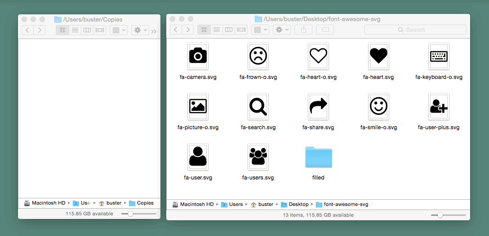
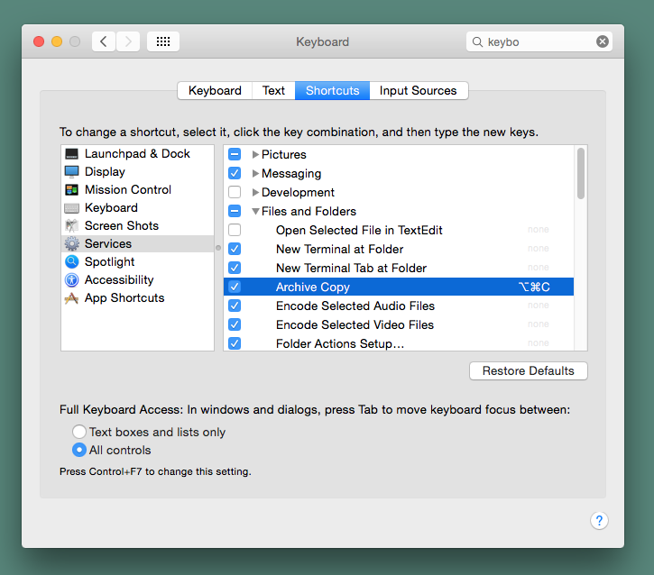

# Archive Copy - Automator Workflow
OS X Automator workflow that archives all files copied using Finder to `~/Copies`

- Keeps the last items copied on the clipboard for pasting elsewhere
- Assign and use a special keyboard shortcut for speed
  - e.g. Option-Command-C <kbd>⌥</kbd><kbd>⌘</kbd><kbd>C</kbd>

## Installation

1. Download [the latest release](https://github.com/busterc/archive-copy-automator-workflow/archive/master.zip)
2. Unzip it
3. Move `Archive Copy.workflow` into `~/Library/Services/`
4. Assign a keyboard shortcut:
  -  > System Preferences > Keyboard > Shortcuts > Services > Files and Folders > Archive Copy
    

## License

ISC License (ISC)

Copyright © 2016, Buster Collings

Permission to use, copy, modify, and/or distribute this software for any purpose with or without fee is hereby granted, provided that the above copyright notice and this permission notice appear in all copies.

THE SOFTWARE IS PROVIDED "AS IS" AND THE AUTHOR DISCLAIMS ALL WARRANTIES WITH REGARD TO THIS SOFTWARE INCLUDING ALL IMPLIED WARRANTIES OF MERCHANTABILITY AND FITNESS. IN NO EVENT SHALL THE AUTHOR BE LIABLE FOR ANY SPECIAL, DIRECT, INDIRECT, OR CONSEQUENTIAL DAMAGES OR ANY DAMAGES WHATSOEVER RESULTING FROM LOSS OF USE, DATA OR PROFITS, WHETHER IN AN ACTION OF CONTRACT, NEGLIGENCE OR OTHER TORTIOUS ACTION, ARISING OUT OF OR IN CONNECTION WITH THE USE OR PERFORMANCE OF THIS SOFTWARE.
